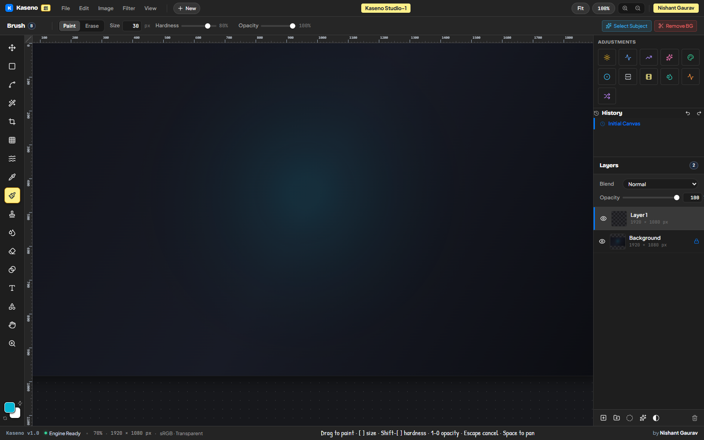
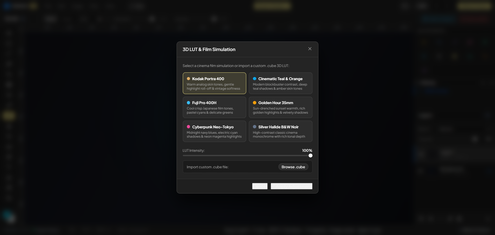
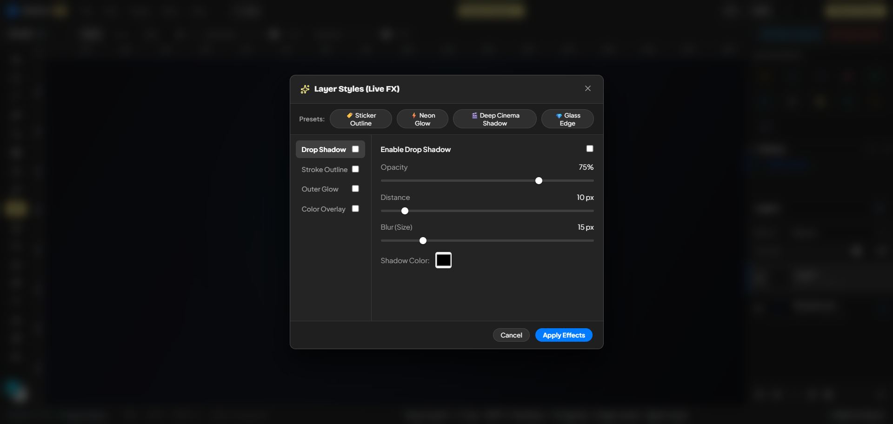
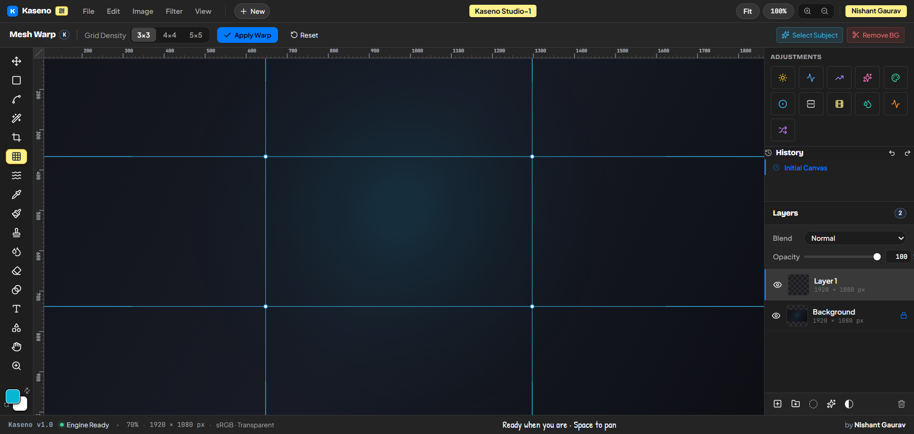
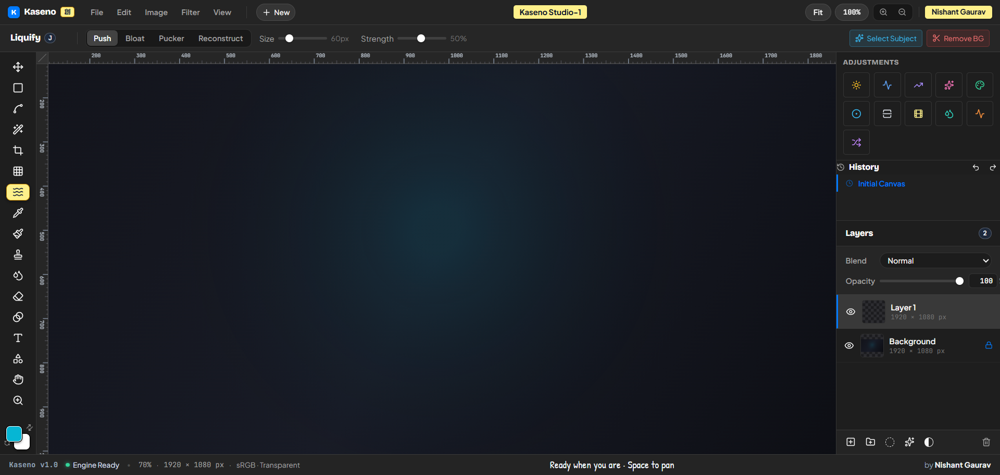

<div align="center">


# 🎨 Kaseno Studio

### Professional Desktop Compositor & Photo Editing Suite for macOS & Windows

<p align="center">
  
  
  
  
</p>

<p align="center">
  <b>Kaseno</b> is a lightweight, non-destructive, studio-grade creative photo compositor engineered for speed and precision.
  Featuring dual native implementations: a <b>Swift/Metal native app for macOS</b> and an <b>Electron/React/TypeScript studio for Windows</b>,
  Kaseno combines desktop-class compositing power with the signature <b>GitKura</b> dark notebook design language.
</p>

---

[](windows/public/images/kaseno-studio-main.png)

*Kaseno Studio — GitKura Canary Yellow Highlights, 27 Blend Modes, Precision Rulers, and Real-Time Compositing Viewport.*

</div>

---

## 📑 Table of Contents

- [Key Highlights](#-key-highlights)
- [Pro Features Showcase](#-pro-features-showcase)
  - [1. 3D LUT Color Grading & Film Simulation](#1-3d-lut-color-grading--film-simulation)
  - [2. Live Layer Effects (Layer Styles Engine)](#2-live-layer-effects-layer-styles-engine)
  - [3. Interactive Mesh Warp & Liquify Engine](#3-interactive-mesh-warp--liquify-engine)
  - [4. AI Smart Select Subject & Background Removal](#4-ai-smart-select-subject--background-removal)
  - [5. Smart Objects & Nested Compositions](#5-smart-objects--nested-compositions)
- [Repository Architecture](#-repository-architecture)
- [Getting Started & Installation](#-getting-started--installation)
  - [Windows & Web Studio](#windows--web-studio-windows)
  - [macOS Native App](#macos-native-app-macos)
- [Keyboard Shortcuts](#-keyboard-shortcuts)
- [Supported Formats](#-supported-formats)
- [Author & License](#-author--license)

---

## ⚡ Key Highlights

| Feature | Description |
|---|---|
| **🎨 GitKura Design System** | Canary yellow `#FEF08A` badge markers, Bricolage Grotesque titles, JetBrains Mono coordinates, and a distraction-free dark studio workspace. |
| **⚡ High Performance Engine** | Hardware-accelerated pixel compositing, sub-millisecond transforms, and multi-tier downsample cache for seamless zoom and pan. |
| **🛡️ 100% Non-Destructive** | Layer masks, clipping masks, non-destructive live adjustment layers, and real-time live Layer Effects without pixel destruction. |
| **🎞️ 3D LUT & Film Grading** | Trilinear interpolation `.cube` parsing with 6 pre-loaded legendary cinema stocks. |
| **🤖 On-Device AI Vision** | Zero-cloud local subject detection and soft alpha boundary matting for 1-click cutout masks. |
| **🌐 True Cross-Platform** | Dedicated native macOS architecture (`macos/`) and modern modular Windows desktop suite (`windows/`). |

---

## 🌟 Pro Features Showcase

### 1. 3D LUT Color Grading & Film Simulation

Transform your color workflow with hardware-accelerated 3D Lookup Tables. Kaseno includes a full `.cube` parser and 6 handcrafted cinema film simulations with smooth intensity blending (0–100%).

<div align="center">
  
</div>

- **Kodak Portra 400**: Warm analog skin tones, gentle highlight roll-off & vintage softness.
- **Cinematic Teal & Orange**: Modern blockbuster contrast, deep teal shadows & amber skin tones.
- **Fuji Pro 400H**: Cool crisp Japanese film tones, pastel cyans & delicate airy greens.
- **Golden Hour 35mm**: Sun-drenched sunset warmth, rich golden highlights & velvety shadows.
- **Cyberpunk Neo-Tokyo**: Midnight navy blues, electric cyan shadows & neon magenta highlights.
- **Silver Halide B&W Noir**: High-contrast classic cinema monochrome with rich tonal depth.
- **Custom `.cube` Import**: Drag and drop any 3D LUT `.cube` file directly into the editor.

---

### 2. Live Layer Effects (Layer Styles Engine)

Non-destructive vector-level live styling rendered in real-time on the composite canvas. Layer styles preserve original pixels and can be edited or toggled at any moment.

<div align="center">
  
</div>

- **Drop Shadow**: Distance, angle ($0^\circ–360^\circ$), blur radius, custom shadow color, and opacity.
- **Stroke Outline**: Outside, Inside, and Center stroke alignments with customizable size and color.
- **Outer Glow**: Soft feathered ambient glows with neon color mapping.
- **Color Overlay**: Dynamic color tinting with 27 blend modes and alpha mixing.
- **1-Click Pro Presets**: Instant *Sticker Outline*, *Neon Glow*, *Deep Cinema Shadow*, and *Glass Edge*.

---

### 3. Interactive Mesh Warp & Liquify Engine

Sculpt, twist, and deform your layers with smooth Bezier grids and physics-based liquify brushes.

<div align="center">
  
</div>

- **Mesh Warp**: Choose between $3\times3$, $4\times4$, or $5\times5$ Bezier grid densities. Grab and drag handles directly on the canvas with real-time triangular texture mapping deformation.
- **Liquify Suite**:
  - **Push**: Forward warp deformation in the direction of mouse drag.
  - **Bloat**: Radial outward expansion for accentuating focal points.
  - **Pucker**: Radial inward pinch for slimming and tightening boundaries.
  - **Reconstruct**: Smoothly restore warped pixels back to their original state.

<div align="center">
  
</div>

---

### 4. AI Smart Select Subject & Background Removal

Perform instant cutouts without sending your data to any external server. Kaseno's local on-device saliency engine analyzes edge boundaries, color histograms, and spatial center-of-mass distributions in milliseconds.

- **✂️ Remove BG**: Creates a feathered, non-destructive layer mask on the active layer in 1 click.
- **✨ Select Subject**: Outlines the primary subject with animated marching ants for rapid editing, copying, or masking.

---

### 5. Smart Objects & Nested Compositions

Pack complex groups of layers into self-contained Smart Objects (`isSmartObject`).
- **Badge Indicators**: Identified by a golden **`[SO]` badge** on the layer row.
- **Sub-Composition Editing**: Double-click any Smart Object thumbnail to open its internal document in a dedicated workspace tab. Changes automatically propagate to parent composites.

---

## 🏛️ Repository Architecture

The codebase is organized as a clean, production-grade monorepo segregating platform targets while sharing documentation:

```
Kaseno/
├── 📁 .github/              # CI/CD verification workflows (Tests both macOS & Windows)
│   └── workflows/verify.yml
│
├── 📁 macos/                # 🍎 Native macOS Application
│   ├── Config/              # Info.plist & Sandbox Entitlements
│   ├── Kaseno/              # Swift / SwiftUI / AppKit source & Metal shaders
│   ├── Kaseno.xcodeproj     # Xcode project & build schemes
│   ├── KasenoTests/         # Unit & performance test suites
│   ├── KasenoUITests/       # Automated UI interaction test suites
│   └── scripts/             # DMG packaging & notarization scripts
│
├── 📁 windows/              # 🪟 Windows & Web Studio Application
│   ├── electron/            # Native desktop windowing & local OS bridge
│   ├── public/              # Application icons, manifest & assets
│   ├── src/
│   │   ├── components/      # UI Panels, Modals, Viewport, Toolbar & TitleBar
│   │   ├── engine/          # 3D LUT, Warp, Liquify, AI Mask, Renderer, Brush
│   │   ├── styles/          # GitKura studio CSS & typography tokens
│   │   ├── types/           # Document, layer, and tool interfaces
│   │   ├── App.tsx          # Studio root workspace coordinator
│   │   ├── index.css        # Base layout & font imports
│   │   └── main.tsx         # React DOM bootstrap
│   ├── package.json         # Studio dependencies & scripts
│   ├── tsconfig.json        # TypeScript configuration
│   └── vite.config.ts       # Vite build & bundler configuration
│
├── 📄 .gitignore            # Multi-platform ignore (Node, Xcode, DerivedData, dist)
├── 📄 AGENTS.md             # Developer & AI pair-programming instructions
├── 📄 LICENSE               # MIT License
├── 📄 package.json          # 🚀 Root workspace runner (dev, build, start)
└── 📄 README.md             # Comprehensive project documentation
```

---

## 🚀 Getting Started & Installation

### Windows & Web Studio (`windows/`)

Requirements: **Node.js 18+** (Node.js 20+ recommended).

Run directly from the repository root:

```bash
# 1. Install dependencies
npm --prefix windows install

# 2. Start hot-reloading development server (default: http://localhost:5173)
npm run dev

# 3. Build optimized production bundle
npm run build

# 4. Launch as native Windows desktop Electron application
npm start
```

### macOS Native App (`macos/`)

Requirements: **macOS 14.0+** and **Xcode 15.0+** (optimized for Apple silicon).

```bash
# Build macOS application from terminal
xcodebuild -project macos/Kaseno.xcodeproj -scheme Kaseno -destination 'platform=macOS' build

# Run automated unit test suite
xcodebuild -project macos/Kaseno.xcodeproj -scheme Kaseno -destination 'platform=macOS' test
```

Or open `macos/Kaseno.xcodeproj` in Xcode, select the **Kaseno** scheme, and press **⌘R** to run.

---

## ⌨️ Keyboard Shortcuts

| Shortcut | Action | Scope |
|---|---|---|
| `V` | Move / Transform Tool | Tools |
| `B` | Brush Tool | Tools |
| `E` | Eraser Tool | Tools |
| `M` | Marquee Selection (Rect / Ellipse) | Tools |
| `L` | Lasso Selection | Tools |
| `W` | Magic Wand Selection | Tools |
| `S` | Clone Stamp Tool | Tools |
| `K` | Mesh Warp Tool | Tools |
| `J` | Liquify Tool | Tools |
| `T` | Type Tool | Tools |
| `U` | Vector Shape Tool | Tools |
| `I` | Eyedropper Tool | Tools |
| `H` / `Space + Drag` | Pan Viewport Canvas | Navigation |
| `Ctrl + +` / `Ctrl + -` | Zoom In / Out | View |
| `Ctrl + 0` | Fit Canvas to Screen | View |
| `Ctrl + 1` | Actual Pixels (100% Zoom) | View |
| `Ctrl + Z` / `Ctrl + Shift + Z` | Undo / Redo | History |
| `Ctrl + Shift + N` | New Blank Layer | Layers |
| `Ctrl + J` | Duplicate Active Layer | Layers |
| `Ctrl + G` | Group Layers into Folder | Layers |
| `Delete` / `Backspace` | Delete Active Layer | Layers |

---

## 📦 Supported Formats

- **Native Documents**: `.kaseno` & `.comp` zip-based packages with full layer hierarchies, masks, and edit history.
- **Photoshop Documents**: Import `.psd` and `.psb` files with preserved blend modes, opacity, and layer trees.
- **Standard Raster**: PNG, JPEG, WebP, BMP, and SVG vector shapes.
- **Color Grading**: `.cube` 3D LUT tables (17x17x17, 33x33x33, 65x65x65).

---

## 👤 Author & Credits

- **Creator & Lead Developer**: **Nishant Gaurav** ([@codewithevilxd](https://github.com/codewithevilxd))
- **Design Language**: Inspired by **GitKura** & Apple Pro Creative Workflows.
- **License**: Released under the **[MIT License](LICENSE)**. Open source and free for commercial and personal use.

---

<div align="center">
  <sub>Built with passion for creators. Crafted with precision for high-performance visual storytelling.</sub>
</div>
